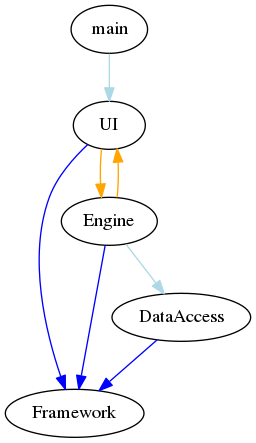
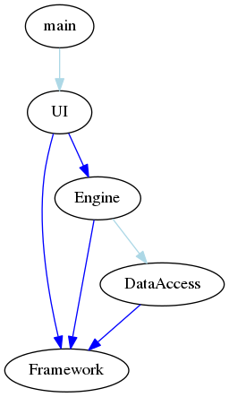

# Read Me for Dependency Checker

Copyright (C) 2012-2017, TomTom International BV. All rights reserved.
----

The tool `cpp-dependencies` creates `#include` dependency information for C++ source
code files, which it derives from scanning a full source tree.

The dependency information is output as `.dot` files, which can be visualized
in, for example, [GraphViz](http://www.graphviz.org).

Happy coding!

Peter Bindels and Rijn Buve

*TomTom International BV*

# License

Licensed under the Apache License, Version 2.0 (the "License");
you may not use this file except in compliance with the License.
You may obtain a copy of the License at

   http://www.apache.org/licenses/LICENSE-2.0

Unless required by applicable law or agreed to in writing, software
distributed under the License is distributed on an "AS IS" BASIS,
WITHOUT WARRANTIES OR CONDITIONS OF ANY KIND, either express or implied.
See the License for the specific language governing permissions and
limitations under the License.

# Build and run

The tool depends on Boost.Filesystem being available and usable. Installing this
should be done with your platform's package management system, such as Apt, 
Pacman or Brew.

The build configuration is created with _CMake_.
To create the build configuration for your build system (GNU make, MSBuild/Visual Studio)
create a build directory outside this source directory and run

    cmake <PATH_TO_THIS_SOURCE_DIR>
    
If you want to use Boost::Filesystem instead of std::filesystem, if your platform does 
not have a std::filesystem implementation yet or if you prefer it, add `-DWITH_BOOST` 
to the invocation of _CMake_. 

To build the tool, either execute

    make

for GNU make or open the Visual Studio solution file generated in the build directory.

This creates the executable file `cpp-dependencies`.

To check if the tool was compiled correctly, execute:
  
    ./cpp-dependencies
    
This provides help information about the tool. More information about
its usage is presented in the next paragraph.
    
    
# Using `cpp-dependencies` to analyze a component

As a first thing on a code base is to find out whether it can read the code correctly. From the root of the project, 
run the command:

    cpp-dependencies --stats .

to determine the complexity of the code base and the amount of nodes that are entangled in cycles with other 
components. In well set-up projects, the cycle count will be equal to zero and the amount of components will be in 
the same order of size as the logical components you expect.

To investigate a specific component, you can use 

    cpp-dependencies --info <component> .
    
for all information the tool has on the component, or:    

    cpp-dependencies --inout <component> .
    
to find out who links to and from your component.

In case you have a dependency that you were not expecting, or find out that when rebuilding component A that a
supposedly-unrelated component B is built, you can use:

    cpp-dependencies --shortest A B .

to determine why there is a link from component A to component B. It will find one of the shortest paths it can find 
from A to B if there is one.

# Using `cpp-dependencies` to make visualized graphs

The tool is also able to provide output in `.dot` format, which is a format used by [GraphViz](http://www.graphviz.org) and other tools to contain
graphs. It is a human-readable format and can be used by the dot tool to convert it into a graphical image. To create
a graph file, use:

    cpp-dependencies --graph mygraph.dot .

to create a mygraph.dot file containing the full component graph. 

You can restrict the component graph to either all
components beneath a given target (`--graph-for <output> <target>`) or all components part of a cycle (`--graph-cycles`). 

To make this text-format graph into a viewable graph, use for example:

    dot -Tpng mygraph.dot >mygraph.png

to convert it into a PNG file. 

The `dot` program will try to find a way to graphically display the graph output. Note that
very large graphs, in particular if many cycles are present, can take hours to render.

# Example use of `cpp-dependencies`

In the source tree there's a folder `example` which contains an empty skeleton project, which does have some dependency information to be extracted from it. To start analyzing it, we first run the tool to extract statistics:

    > cpp-dependencies --dir example --stats
    6 components with 5 public dependencies, 1 private dependencies
    Detected 2 nodes in cycles

This informs us that there is something not quite right with the dependencies. It sees 6 components: the root folder, four libraries and an executable. The simplest way to find out what's wrong is to draw out the graph in a visual way:

    > cpp-dependencies --dir example --graph dependencies.dot
    > dot -Tpng dependencies.dot >dependencies.png

Then open this PNG file in any tool that can view it, such as a web browser. This shows us the following image:

The light blue links are an implementation-only link, the dark blue ones expose some part of this dependency on their interface. The orange ones are the most interesting ones; they are places where a component can reach itself through some other component. Let's find out why this is there:

    > cpp-dependencies --dir example --shortest Engine UI
    Engine -> UI
      ./Engine/Engine.h includes ./UI/Display.h
    > cpp-dependencies --dir example --shortest UI Engine
    UI -> Engine
      ./UI/Display.cpp includes ./Engine/Engine.h
      ./UI/Display.h includes ./Engine/Engine.h

At this point, it's up to the developer or architect to find out which of these two dependencies is the wrong way around and to find a way around that. In the example, the Engine component should not be talking directly to the UI component. Removing this dependency results in the following statistics:

    > cpp-dependencies --dir example --stats
    6 components with 4 public dependencies, 2 private dependencies
    Detected 0 nodes in cycles

The cycle has been removed, and there is one less dependency. We can find out what the shortest path is to the DataAccess component from the executable:

    > cpp-dependencies --dir example --shortest main DataAccess
    main -> UI
      ./main/main.cpp includes ./UI/Display.h
    UI -> Engine
      ./UI/Display.cpp includes ./Engine/Engine.h
      ./UI/Display.h includes ./Engine/Engine.h
    Engine -> DataAccess
      ./Engine/Engine.cpp includes ./DataAccess/DA.h

This tells us that there's no path shorter than three steps, and it informs us for each step of the way why it detects this link. In more complicated cycles, this can be a way to isolate the thinnest part of the cycle. In situations where there's an invalid dependency from one component to another - for example, from a unit test of one component to a very far away different component, this can help you identify where on the path from A to B a wrong link is present. It can also be used to explicitly verify that a link is not present, such as the one we just removed:

    > cpp-dependencies --dir example --shortest Engine UI
    No path could be found from Engine to UI

The graph now also shows proper dependency ordering:

    > cpp-dependencies --dir example --graph newdependencies.dot
    > dot -Tpng newdependencies.dot >newdependencies.png

We can regenerate the CMakeLists.txt files as well to remove the dependency from the build inputs, so that our build system will also know that the link is no longer present:

    > cpp-dependencies --dir example --dryregen
    Difference detected at "./Engine"
    > cpp-dependencies --dir example --regen

# Customizing the outputs

As cpp-dependencies has a lot of analysis it can do on the source tree, there are also some configurable parts to it. The configuration can be found in the file config-cpp-dependencies.txt that should be in your project root. It allows you to customize the colors used in generation, the thresholds for outlier detection and some minor parameters. Please read the documentation in the example config-cpp-dependencies.txt that is in the source distribution for the tool to see all the options.

# Editing the tool

The tool itself is split up into a few separate files to make it easier to find and extend its functionality. The following files are found:

* `main.cpp` contains the main functions and help information, as well as the core flow.
* `Input.cpp` contains the functions that read C++ and `CMakeLists` files into the information needed by the tool.
* `Output.cpp` contains functions to write all output files generated, except for the `CMakeLists` generation.
* `CmakeRegen.cpp` contains the functionality to write `CMakeLists` files.
* `Analysis.cpp` contains all graph processing and navigation functions.
* `Component.cpp` contains the implementation needed for the struct-like data storage classes.
* `generated.cpp` contains the function to convert found header files into a lookup map. Also the place to add generated files
    to the known file list, so that they will be taken into account for components.
* `Constants.h` contains the constants used throughout the code base.

In general, the root functionality is kept in `main.cpp`, the structural classes are kept in `Component.cpp` 
and any auxiliary functions that are used to do this are split up by domain.

# Rationale behind implementation

The tool was implemented with the goal of being able to quickly analyze dependencies between components of a 
complex project, including how the dependency graph changes when some changes are made to the source tree. To 
accomplish this, choices were made in the direction of more performance at the expense of strict correctness. 
Specifically:

- It does not use a proper C++ parser to read C++ files, nor a proper CMake parser to read CMake files. Properly
  parsing these files would increase the full run time of the program by orders of magnitude and make it much less
  useful.
- `strstr` is used across the full code base. While profiling, we found that `std::string::find` was taking over 80% of
  the full runtime. Replacing it with `strstr`, which is typically much more optimized, made the whole program twice 
  as fast.

This results in it running on a 1.5GB source code base in about 2.1 seconds -- fast enough for interactive checks and
rerunning after any small modification. 

The tool was set up to compile on a Ubuntu 12.04 system with the platform default compiler. This means that the sources will use C++11
but will not use anything not available in GCC 4.6. It has been tested and used on Linux (Ubuntu 12.04 - 16.04) and MacOS X 
(different versions).

# Using Git and `.gitignore`

It's good practice to set up a personal global `.gitignore` file on your machine which filters a number of files
on your file systems that you do not wish to submit to the Git repository. You can set up your own global
`~/.gitignore` file by executing:
`git config --global core.excludesfile ~/.gitignore`

In general, add the following file types to `~/.gitignore` (each entry should be on a separate line):
`*.com *.class *.dll *.exe *.o *.so *.log *.sql *.sqlite *.tlog *.epoch *.swp *.hprof *.hprof.index *.releaseBackup *~`

The local `.gitignore` file in the Git repository itself to reflect those file only that are produced by executing
regular compile, build or release commands.

# Bug reports and new feature requests

If you encounter any problems with this library, don't hesitate to use the `Issues` session to file your issues.
Normally, one of our developers should be able to comment on them and fix.

